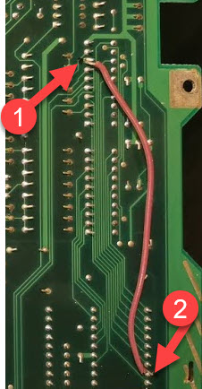
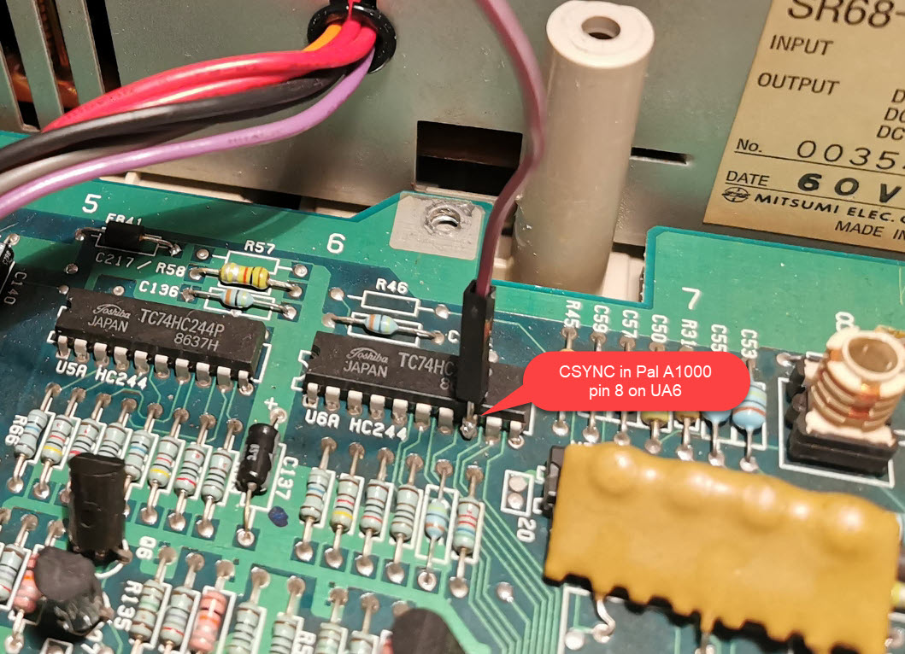

# Amiga 1000 CPLD Adapter V1

This adaptor uses a CPLD to pass the RGB and sync signals from the Amiga 1000 Denise socket to the Rasperry Pi Zero. It derives the pixel clock in a very different way to other designs and therefore does not require a jumper for Denise / Super Denise and has no "sparkling" pixel issues. It also has the advantage of being firmware upgradable if there are any issues found in the logic.

## BOM

| Symbol       | Component                         |
| ------------ | --------------------------------- |
| C1, C2, C3   | 0.1uF 0603                        |
| J1           | 2x20pin socket 2.54mm             |
| J2           | 1pin right angle header 2.54mm    |
| JButton1 - 3 | 2pin right angle header 2.54mm    |
| R1           | 1K 0603                           |
| R2           | 4.7K 0603                         |
| U1           | XC9572XL-10VQG44C                 |

### Notes

- It is important that R1 is 1K due to the low value of the internal pull resistor in GPIO0 of the Pi, the other pull resistors are more flexible. If the value is too high then the software won't detect this is an Amiga board and won't show the correct firmware in the recovery menu.
- This board can be used in single button mode with just JButton1 or with three button mode.
- J2 is optional if you have already wired CSYNC to the Denise socket

## CSYNC

The Amiga 1000 does not have CSYNC wired to Denise. There are two ways around this, the first is to wire CSYNC to the Denise socket on the motherboard using a patch wire. On a PAL system this is pin 8 of UA6 to pin 32 of Denise as below:

Alternatively you can use the "CSYNC IN" on the RGB to HDMI board to hook onto the relevant CSYNC signal. On the PAL version this is pin 8 or UA6 as can be seen below:

Thanks to @SirCathal for the above two photos.

## Pi Software Installation

The software on the Pi should be at least the latest 20210529 release from the [main tree](https://github.com/hoglet67/RGBtoHDMI/releases) or the latest [IanSB beta release](https://github.com/IanSB/RGBtoHDMI/releases) extracted onto a micro SD card in FAT32 format.

You need to copy some canned profile files into place for the board:

* `Amiga_CPLD_Readme/Amiga_CPLD_Setup/profile_6-12_BIT_RGB.txt` to the root of the SD card
* `Amiga_CPLD_Readme/Amiga_CPLD_Setup/Profiles/Default.txt` to the `Profiles` directory

This resolves some issues with mode switching, particularly on NTSC machines. The profile copied will automatically set `single_button_mode`.

## Flashing the CPLD

The CPLD will need flashing with the `6-12_BIT_RGB_CPLD` firmware. The other firmware options are not compatible with the profiles.

If you have followed the software steps above you will get a recovery menu, select `6-12_BIT_RGB_CPLD`, confirm and the Pi will flash the CPLD and reboot.

## Initial Setup

You may see a shimmer or wavy effect. This is because the phase is set incorrectly and needs calibration, this is a one-off easy thing to do. If you have a static image such as the Kickstart 1.3 boot screen or Workbench with no mouse movement you can use the "Auto Calibrate Video Settings" option (it will require you to select twice to activate). Alternatively you can go into the "Sampling" menu and change the "Sampling Phase" until the image looks correct. Typically 0, 3 or 5 will work fine, but it could be different in each machine.

Once calibrated choose "Save Configuration" and this will be remembered for subsequent boots.

## Buying PCBs

I've made the [PCBs available on PCBWay here](https://www.pcbway.com/project/shareproject/Amiga_1000_CPLD_RGBtoHDMI_v1_1.html)
