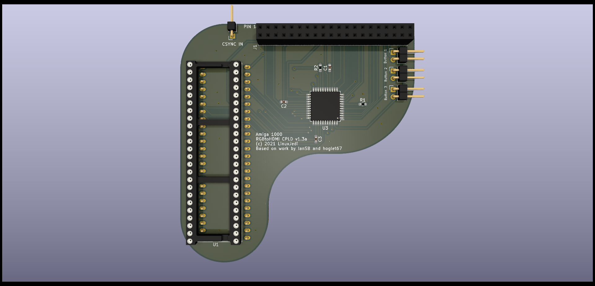

# Amiga 1000 CPLD Adapter V1

This adaptor uses a CPLD to pass the RGB and sync signals from the Amiga 1000 Denise socket to the Rasperry Pi Zero. It derives the pixel clock in a very different way to other designs and therefore does not require a jumper for Denise / Super Denise and has no "sparkling" pixel issues. It also has the advantage of being firmware upgradable if there are any issues found in the logic.

## BOM

| Symbol       | Component                         |
| ------------ | --------------------------------- |
| C1, C2, C3   | 0.1uF 0603                        |
| J1           | 2x20pin socket 2.54mm             |
| J2           | 1pin right angle header 2.54mm    |
| JButton1 - 3 | 2pin right angle header 2.54mm    |
| R1           | 1K 0603                           |
| R2           | 4.7K 0603                         |
| U1           | XC9572XL-10VQG44C                 |

### Notes

- The resistors are pull-downs and as such are flexible as to value.
- This board can be used in single button mode with just JButton1 or with three button mode.
- J2 is optional if you have already wired CSYNC to the Denise socket

## CSYNC

The Amiga 1000 does not have CSYNC wired to Denise. There are two ways around this, the first is to wire CSYNC to the Denise socket on the motherboard using a patch wire. On a PAL system this is pin 8 of UA6 to pin 32 of Denise as below:

Alternatively you can use the "CSYNC IN" on the RGB to HDMI board to hook onto the relevant CSYNC signal. On the PAL version this is pin 8 or UA6 as can be seen below:

Thanks to @SirCathal for the above two photos.

## Pi Software Installation

The software on the Pi should be the latest beta release from https://github.com/IanSB/RGBtoHDMI/releases extracted onto a micro SD card in FAT32 format.

If you wish to use single button mode, you then need to edit `Profiles/Default.txt` and set the option `single_button_mode=1` (it is near the bottom of the file).

## Flashing the CPLD

The CPLD will need flashing with the `6-12_BIT_RGB_CPLD` or `6-12_BIT_BBC_CPLD` firmware.

With the beta software the Pi can flash the CPLD when it detects the firmware is not installed. This doesn't work in the non-beta release at the moment as the required firmware will not be shown. Also if you are using single button mode, this doesn't work in the recovery menu in the main release.

If you have followed the software steps above you will get a recovery menu, select the firmware above and the Pi will flash the CPLD and reboot.

## Initial Setup

You'll get a rollaing image on the initial bootup after flashing and the colours will be off. This is because the incorrect profile is in use by default. Use the buttons with the menu system to select the "Amiga 2000" profile. The regulare "Amiga" profile will not fix the rolling image because it expects CSYNC and not H/V sync used on the A2000 board.

You may also see a shimmer or wavy effect. This is because the phase is set incorrectly and needs calibration, this is a one-off easy thing to do. If you have a static image such as the Kickstart 1.3 boot screen or Workbench with no mouse movement you can use the "Auto Calibrate Video Settings" option (it will require you to select twice to activate). Alternatively you can go into the "Sampling" menu and change the "Sampling Phase" until the image looks correct. Typically 0, 3 or 5 will work fine, but it could be different in each machine.

Once calibrated choose "Save Configuration" and this will be remembered for subsequent boots.

