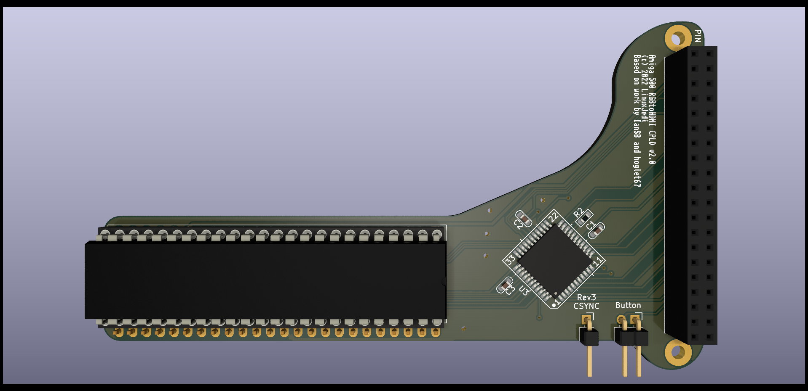

# Amiga 500 CPLD RGBtoHDMI

This adaptor uses a CPLD to pass the RGB and sync signals from the Amiga 500 Denise socket to the Rasperry Pi Zero. It derives the pixel clock in a very different way to the c0pperdragon design and therefore does not require a jumper for Denise / Super Denise and has no "sparkling" pixel issues. It also has the advantage of being firmware upgradable if there are any issues found in the logic.

## BOM

| Symbol     | Component                         |
| ---------- | --------------------------------- |
| C1         | Optional 10uF 1206                |
| C2, C3, C4 | 0.1uF 0603                        |
| J1         | 2x20pin socket 2.54mm             |
| JP1        | 2pin right angle header 2.54mm    |
| R1, R2     | 1K 0603                           |
| R3         | 4.7K 0603                         |
| U1         | 48pin DIP socket 2.54mm           |
| U2         | 2x24pin SILs machined pins 2.54mm |
| U3         | XC9572XL-10VQG44C                 |

### Notes

- In my own builds I do not populate C1. You could use this for a 3.9v LED I guess
- You'll need some kind of push button to connect to JP1

## Flashing the CPLD

The CPLD will need flashing with the `6-12_BIT_RGB_CPLD` firmware. I've personally tested with `6-12_BIT_RGB_CPLD_v92` version.

In theory the software on the Pi should be able to flash the CPLD when it detects the firmware is not installed. At the moment there is a bug in the RGBtoHDMI software that doesn't let the CPLD recovery mode use single button mode. This leaves you with two options:

### Option 1: soldering wires

You can temporarily solder wires to GPIO pins 37 for switch 2, 35 for switch 3 and somewhere for ground (such as pin 39). Touch one of the switch wires against the ground wire to use that switch. You can now use this menu properly.

### Option 2: manual JTAG flashing

The JTAG pins are:

| GPIO pin                       | Signal |
| ------------------------------ | ------ |
| 1 or 17                        | 3v3    |
| 6, 9, 14, 20, 25, 30, 34 or 39 | GND    |
| 27                             | TDI    |
| 28                             | TMS    |
| 38                             | TDK    |
| 18                             | TDO    |

You can use any standard JTAG programmer, or even a Raspberry Pi as can be seen here: https://linuxjedi.co.uk/2020/12/01/programming-xilinx-jtag-from-a-raspberry-pi/

If you are using Pi method you will need to compile the JED file which can be done in the free Xilinx ISE Design Suite.

## Pi Software Installation

The software on the Pi should be the latest release from https://github.com/hoglet67/RGBtoHDMI/releases extracted onto a micro SD card in FAT32 format.

You then need to edit `Profiles/Default.txt` and set the option `single_button_mode=1` (it is near the bottom of the file).

## Initial Setup

On first boot the colours will look wrong and it the image will likely not be very good quality. This is because it uses an Acorn computer profile by default. You should use the main menu to change the profile to Amiga.

You may also see a shimmer or wavy effect. This is because the phase is set incorrectly and needs calibration, this is a one-off easy thing to do. If you have a static image such as the Kickstart 1.3 boot screen or Workbench with no mouse movement you can use the "Auto Calibrate Video Settings" option (it will require you to select twice to activate). Alternatively you can go into the "Sampling" menu and change the "Sampling Phase" until the image looks correct. Typically 0, 3 or 5 will work fine, but it could be different in each machine.

Once calibrated choose "Save Configuration" and this will be remembered for subsequent boots.
