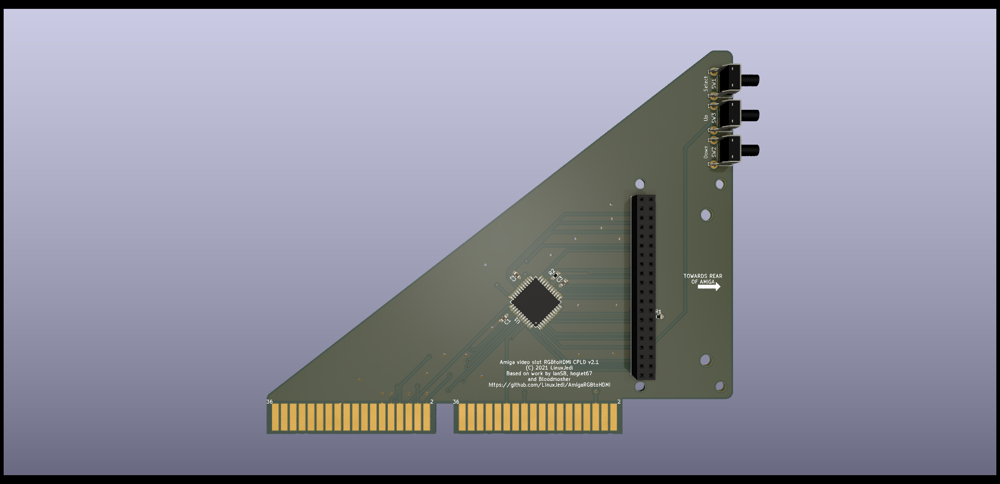

# Amiga CPLD Video Slot Adapter

This adaptor uses a CPLD to pass the RGB and sync signals from the Amiga 2000 video slot to the Rasperry Pi Zero. It derives the pixel clock in a very different way to other designs and therefore does not require a jumper for Denise / Super Denise and has no "sparkling" pixel issues. It also has the advantage of being firmware upgradable if there are any issues found in the logic.

Version 2 of this board is logically identical to version 1, but is designed to be easier to build and easier for the user to install. The Pi faces the rear of the Amiga so that the HDMI can be plugged directly into it and instead of wires it uses physical buttons.

**ATTENTION PI Zero 2W users**: You can now use a Pi Zero 2W with the CPLD RGBtoHDMI using 24th December 2021 release onwards.

## BOM

| Symbol       | Component                               |
| ------------ | --------------------------------------- |
| C1 - C3      | 0.1uF 0603                              |
| J1           | 2x20pin socket 2.54mm                   |
| SW1 - SW3    | SKHHLQA010 90° SPST 8.35mm push button  |
| R1           | 1K 0603                                 |
| R2           | 4.7K 0603                               |
| U1           | XC9572XL-10VQG44C                       |

### Notes

- R1 needs to be a 1K pull resistor due to the low value internal I2C pull resisors in the Pi. If the value is too high then the software won't detect this is an Amiga board and won't show the correct firmware in the recovery menu.
- This board can be used in single button mode with just SW1.
- You can use smaller push buttons but they won't reach outside of the A2000's case, this may be fine with the correct bracket.
- Brackets for the original A2000 RGBtoHDMI boards are **NOT** compatible, the mounting holes have been moved.
- It is recommended you use 4x11mm M2.5 standoffs to hold the Pi in place, alternatively you can use 10mm M2.5 standoffs and 1mm M2.5 washers.

## Pi Software Installation

The software on the Pi should be at least the latest 20211224 release from the [main tree](https://github.com/hoglet67/RGBtoHDMI/releases) or the latest [IanSB beta release](https://github.com/IanSB/RGBtoHDMI/releases) extracted onto a micro SD card in FAT32 format.

You need to copy some canned profile files into place for the board:

* `Amiga_CPLD_Readme/Amiga_2000_CPLD_Setup/profile_6-12_BIT_RGB.txt` to the root of the SD card
* `Amiga_CPLD_Readme/Amiga_2000_CPLD_Setup/Profiles/Default.txt` to the `Profiles` directory

This resolves some issues with mode switching, particularly on NTSC machines.

If you wish to use three button mode, you then need to edit `Profiles/Default.txt` and set the option `single_button_mode=0` (it is near the bottom of the file).

## Flashing the CPLD

The CPLD will need flashing with the `6-12_BIT_RGB_CPLD` firmware. The other firmware options are not compatible with this board.

If you have followed the software steps above you will get a recovery menu, select `6-12_BIT_RGB_CPLD`, confirm and the Pi will flash the CPLD and reboot.

## Initial Setup

You may see a shimmer or wavy effect. This is because the phase is set incorrectly and needs calibration, this is a one-off easy thing to do. If you have a static image such as the Kickstart 1.3 boot screen or Workbench with no mouse movement you can use the "Auto Calibrate Video Settings" option (it will require you to select twice to activate). Alternatively you can go into the "Sampling" menu and change the "Sampling Phase" until the image looks correct. Typically 0, 3 or 5 will work fine, but it could be different in each machine.

Once calibrated choose "Save Configuration" and this will be remembered for subsequent boots.

## Buying PCBs

I've made the [PCBs available on PCBWay](https://www.pcbway.com/project/shareproject/Amiga_2000_CPLD_RGBtoHDMI_v2_1_83f23b25.html).

A limited edition version of this board with the LinuxJedi logo containing a glowing lightsaber can be found [on Tindie](https://www.tindie.com/products/linuxjedi/amiga-2000-rgb-to-hdmi/).

## Bracket

Comming soon.
