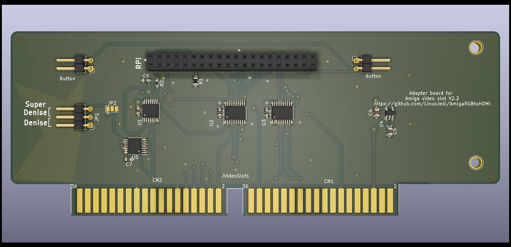

# Amiga Video Slot Adapter V2

**NOTE:** This is now a legacy project, please see the Amiga 2000 CPLD version also in this GitHub repository.

This adapter builds on the ideas from the Amiga Denise adapter V2, adapted for use in big box Amiga video slots. LinuxJedi's Version 2 is based on Bloodmosher's V1 design but has been modified for reliability and to provide timing options.

The main differences from the Amiga Denise V2 are:
- The 7MHZ signal is derived via C1 XNOR C3 since 7MHZ is not available directly from the video slot
- Two button connectors allow for both a rear slot cover bracket button and another to be used, mounted wherever desired

The main differences from the V1 slot adaptor are:
- ICs moved to more appropriate locations
- Fixed floating inputs on U5
- Added ground pour and more grounding points for RGB and Pi
- Manually rerouted everything (fewer signal vias)
- Added option to use U1 for the inverted C1, C3 XNOR (which makes it an XOR)
- Added RC based delay option
- Input capacitor added to the regulator
- Rounded the corners a little more

## LinuxJedi's build notes

### Options

 - For U1 to handle Super Denise timing add 0ohm between pin 1 and 2 of JP2
 - For U5 to handle Super Denies timing add 0ohm between pin 2 and 3 of JP2
 - C6 is an optional capacitor for timing delay, 47pF has been recommended by some but can be left unpopulated
 - R2 is a resistor for timing delay, it needs to be populated, only 0ohm has been tested

### Recommended build

This is what has worked for me, YMMV.

 - Leave U5 and C7 unpopulated
 - 0ohm 0603 (or wire/solder short) between pins 1 and 2 of JP2
 - 0ohm 0603 in R2
 - C6 unpopulated or 47pF 0603
 - Use TI 74LVC ICs (Toshiba 74VHC for U1 has also been tested with this design and appear to work)
 - Use a regulator that is rated for 300mA or higher (I use NCP161 regulators in my builds)

### Recommended ordering

If you are ordering from JLCPCB I recommend the following:

 - Surface Finish: ENIG
 - Gold Fingers: Yes
 - 45° finger chamfered: yes

## Installation notes

- Set the Denise jumper according to which Denise is in your Amiga (Super Denise for 8373, Denise for 8362)
- Orient the PCB such that the end with bracket mounting holes faces the rear of the machine

## Sparkles in the image

There are a few things to try. First if the sparkling is extreme, try swapping the Denise/Super Denise jumper to the opposite setting, this changes the clock used for the RGB timing. Then you can try a 47pF capacitor in C6 and using 74VHC ICs instead of 74LVC.
