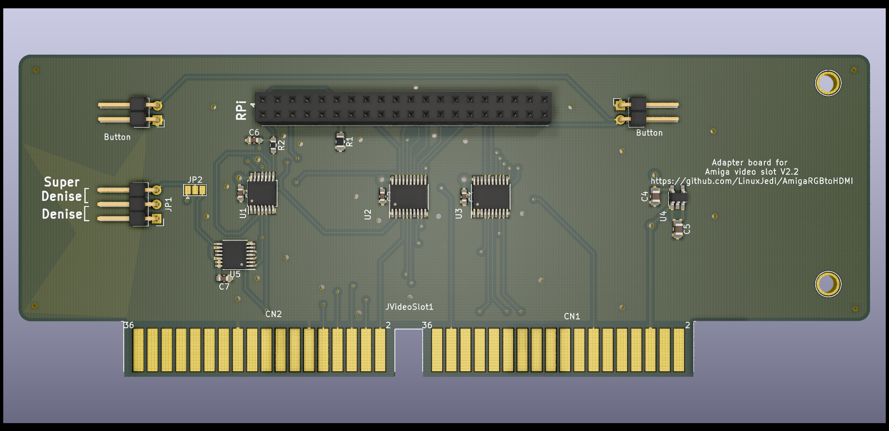
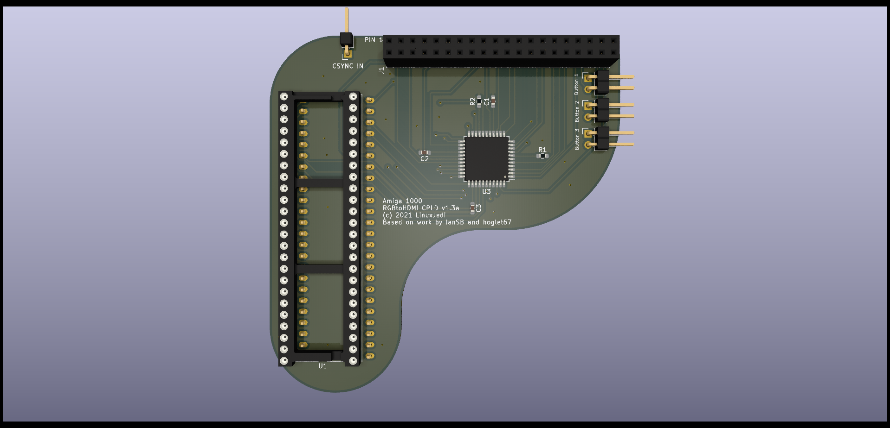

# AmigaRGBtoHDMI

LinuxJedi's designs for Amiga RGBtoHDMI boards.

## Projects in This Tree

### Amiga2000Slot

A variant of Bloodmosher's Amiga 2000 RGBtoHDMI with several changes.

### Amiga500CPLD

Amiga 500 CPLD variant that does not require a jumper and has no sparkling pixel issues.

### Amiga2000CPLDSlot

Amiga 2000 CPLD variant that does not require a jumper and has no sparkling pixel issues

**Currently untested**

### Amiga1000CPLD

Amiga 1000 CPLD variant that does not require a jumper and has no sparkling pixel issues

**Currently untested**

## Other versions

- c0pperdragon's - The excellent original c0pperdragon design can be found at: https://github.com/c0pperdragon/Amiga-Digital-Video/
- solarmon's - Improved versions of c0pperdragon's design to relocate the Pi and add additional features:https://github.com/solarmon/RGBtoHDMI

Please add pull requests to link to your variants here.

## Software

The software used for this project can be found at https://github.com/hoglet67/RGBtoHDMI/

## Ready Built Boards

If you want a ready built board for either design please contact andrew@linuxjedi.co.uk and I can put you in touch with whoever is building / selling at a reasonable price.

Likewise if you are a someone selling these designs, please let me know if you want me to put you in touch with buyers who contact me.

## Sponsorship

If you like these projects and have built / sold a few yourself, please consider sponsoring. R&D for these projects isn't cheap and the sponsorship money goes into more designs for the future. Links for this are can be found in the "Sponsor" button at the top of the GitHub page for this project.
