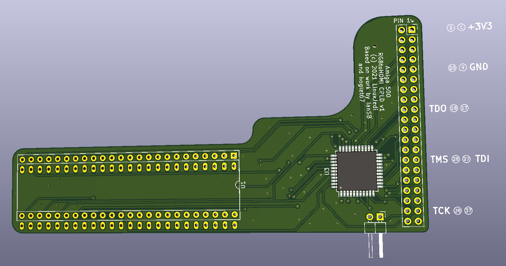

# JTAG pins

The JTAG is accessible on the Pi GPIO header, so you can plug pins into the header to use a JTAG programmer to flash it. If you don't have a JTAG programmer I have [documented how to build one out of a Raspberry Pi](https://linuxjedi.co.uk/2020/12/01/programming-xilinx-jtag-from-a-raspberry-pi/). Note that the GPIO pins xc3sprog use for JTAG are different to the RGBtoHDMI GPIO JTAG pins.

The JTAG pins are:

| GPIO number | GPIO pin                       | Signal |
| ----------- | ------------------------------ | ------ |
| N/A         | 1 or 17                        | 3v3    |
| N/A         | 6, 9, 14, 20, 25, 30, 34 or 39 | GND    |
| 0           | 27                             | TDI    |
| 1           | 28                             | TMS    |
| 20          | 38                             | TCK    |
| 24          | 18                             | TDO    |

If you are using Pi xc3sprog method from the link above you will need to compile the JED file which can be done in the free Xilinx ISE Design Suite.
